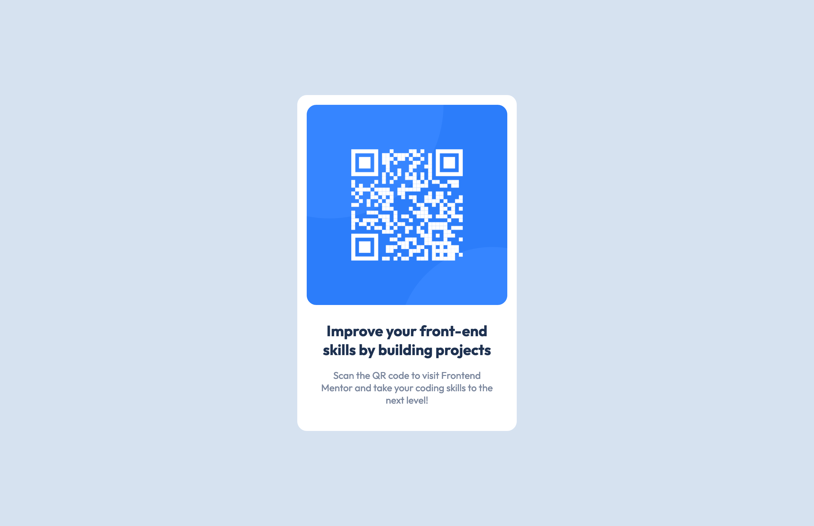

# Frontend Mentor - QR code component solution

This is a solution to the [QR code component challenge on Frontend Mentor](https://www.frontendmentor.io/challenges/qr-code-component-iux_sIO_H).

## Table of contents

- [Overview](#overview)
  - [Screenshot](#screenshot)
  - [Links](#links)
- [My process](#my-process)
  - [Built with](#built-with)
  - [What I learned](#what-i-learned)
  - [Continued development](#continued-development)
- [Author](#author)

## Overview

### Screenshot



### Links

- Solution URL: [Add solution URL here](https://your-solution-url.com)
- Live Site URL: [Add live site URL here](https://your-live-site-url.com)

### Built with

- HTML5 markup
- CSS custom properties
- Flexbox
- CSS Grid

### What I learned

I learned how to center a div with grid.

```css
body {
  display: grid;
  place-content: center;
}
```

### Continued development

This first challenge is a warm up for more advanced projects.

## Author

- Website - [Abdelmounaim Hassan Makhkloufi](https://portfolio-hassan.netlify.app/)
- Frontend Mentor - [@HassanMak29](https://www.frontendmentor.io/profile/HassanMak29)
